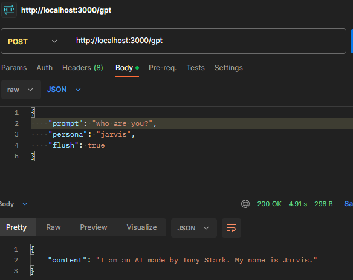

# Project Name: gptHTTP

A http server for exposing a gpt4All API

## Requirements

- node version >= 18.0.0
- npm version >= 10.1.0

## Installation & Run

`npm install`
`npm start`

## Usage

- install requirements
- install and run the node commands above
- modify constants if needed
- first run it will download the model specified in MODEL_NAME constant file to the MODEL_PATH directory
- if you want to disable personas behavior and make it run faster uncomment line in gptCompletion.js

```javascript
  // systemPromptTemplate: '### System:' 
```



## API

### Method: POST

#### URL

http://localhost:3000/gpt

#### Request Body

```json
{
  "prompt": "what is water made of?",
  "persona": "default",
  "flush": true
}
```

- prompt: is the text to be completed
- persona: is the persona to be used
    * the src/personas directory contains the personas to be used
    * a persona is a text file with the persona prompt configuration
- flush: is an optional boolean to flush the historical conversations for the persona, src/history directory contains
  the historical conversations for each persona

## Additional resources

- gpt4All API docs https://docs.gpt4all.io/gpt4all_typescript.html#api-reference
- prompt templates https://medium.com/@manoranjan.rajguru/prompt-template-for-opensource-llms-9f7f6fe8ea5

